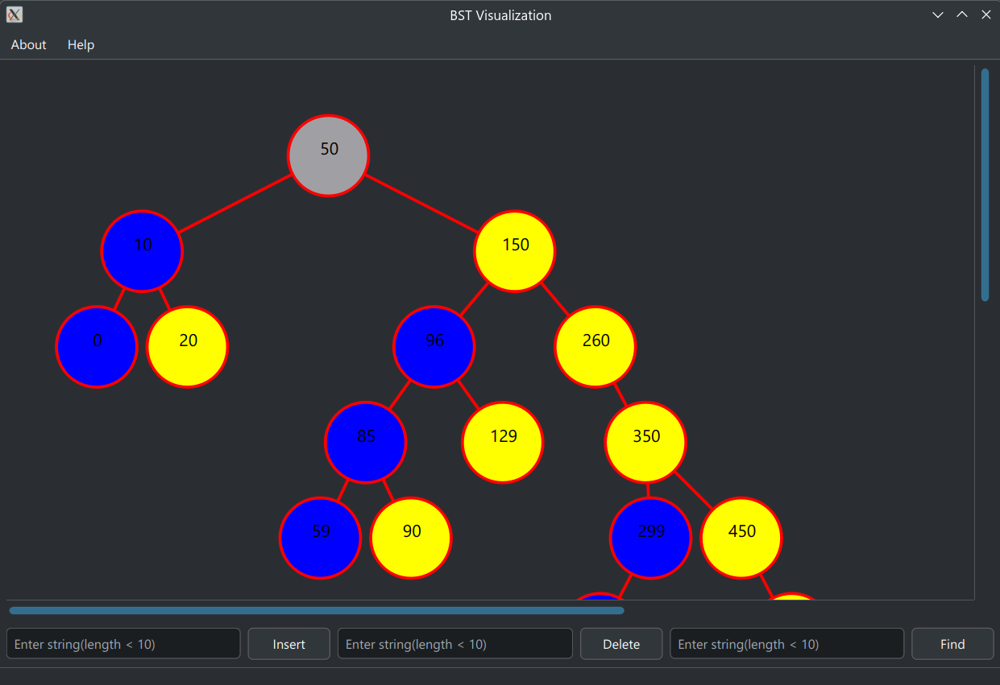

Binary Search Tree Visualization

## About
只是一个数据结构课程的实践项目. `MFC`实在太古老了, `Windows`开发又是没有的, 用`MFC`和`VC`是不可能的. 因此使用了
`Qt6`, 基于`CMake`实现了可视化. 毕竟都`2024`年了, 再用`20`年前的工具也说不过去吧.

## Demo

蓝色是左孩子, 黄色是右孩子, 灰色是根节点.

## Build
`clang version 18.1.8`
`cmake version 3.30.2`
`ninja version 1.12.1`
`qt6   version 6.7.2`

## Environment
本项目在`archlinux`下构建, 只保证`linux`下的正常编译运行. 实际上我已经在构建脚本中做出了检查:
- `g++ version >= 12.0.0`
- `clang++ version >= 14.0.0`
- `cmake version >= 3.25.0`
- `qt6 version >= 6.1.0`

实际上如果希望直接二进制运行, 几乎是不太可能的, 因为对于`linux`发行版就是这样. 包的粒度很细. 每个依赖需要对应的动态库.
并不像`windows`下那般, 可以`fallback`到当前程序所在目录下面的`dll`.

下面给出其编译后的依赖.
```
        linux-vdso.so.1 (0x00007d36b9cc1000)
        libQt6Widgets.so.6 => /usr/lib/libQt6Widgets.so.6 (0x00007d36b9400000)
        libQt6Gui.so.6 => /usr/lib/libQt6Gui.so.6 (0x00007d36b8a00000)
        libQt6Core.so.6 => /usr/lib/libQt6Core.so.6 (0x00007d36b8400000)
        libGLX.so.0 => /usr/lib/libGLX.so.0 (0x00007d36b9c37000)
        libOpenGL.so.0 => /usr/lib/libOpenGL.so.0 (0x00007d36b9c0c000)
        libstdc++.so.6 => /usr/lib/libstdc++.so.6 (0x00007d36b8000000)
        libm.so.6 => /usr/lib/libm.so.6 (0x00007d36b9b1b000)
        libgcc_s.so.1 => /usr/lib/libgcc_s.so.1 (0x00007d36b93d2000)
        libc.so.6 => /usr/lib/libc.so.6 (0x00007d36b7e0f000)
        libEGL.so.1 => /usr/lib/libEGL.so.1 (0x00007d36b9b09000)
        libfontconfig.so.1 => /usr/lib/libfontconfig.so.1 (0x00007d36b9382000)
        libX11.so.6 => /usr/lib/libX11.so.6 (0x00007d36b82bf000)
        libglib-2.0.so.0 => /usr/lib/libglib-2.0.so.0 (0x00007d36b7cc1000)
        libQt6DBus.so.6 => /usr/lib/libQt6DBus.so.6 (0x00007d36b92ca000)
        libxkbcommon.so.0 => /usr/lib/libxkbcommon.so.0 (0x00007d36b9282000)
        libpng16.so.16 => /usr/lib/libpng16.so.16 (0x00007d36b7c87000)
        libharfbuzz.so.0 => /usr/lib/libharfbuzz.so.0 (0x00007d36b7b6d000)
        libmd4c.so.0 => /usr/lib/libmd4c.so.0 (0x00007d36b926c000)
        libfreetype.so.6 => /usr/lib/libfreetype.so.6 (0x00007d36b7aa3000)
        libz.so.1 => /usr/lib/libz.so.1 (0x00007d36b9251000)
        libicui18n.so.75 => /usr/lib/libicui18n.so.75 (0x00007d36b7600000)
        libicuuc.so.75 => /usr/lib/libicuuc.so.75 (0x00007d36b7406000)
        libsystemd.so.0 => /usr/lib/libsystemd.so.0 (0x00007d36b79af000)
        libdouble-conversion.so.3 => /usr/lib/libdouble-conversion.so.3 (0x00007d36b82a6000)
        libb2.so.1 => /usr/lib/libb2.so.1 (0x00007d36b8288000)
        libpcre2-16.so.0 => /usr/lib/libpcre2-16.so.0 (0x00007d36b7374000)
        libzstd.so.1 => /usr/lib/libzstd.so.1 (0x00007d36b7295000)
        /lib64/ld-linux-x86-64.so.2 => /usr/lib64/ld-linux-x86-64.so.2 (0x00007d36b9cc3000)
        libGLdispatch.so.0 => /usr/lib/libGLdispatch.so.0 (0x00007d36b71dd000)
        libexpat.so.1 => /usr/lib/libexpat.so.1 (0x00007d36b7986000)
        libxcb.so.1 => /usr/lib/libxcb.so.1 (0x00007d36b71b2000)
        libpcre2-8.so.0 => /usr/lib/libpcre2-8.so.0 (0x00007d36b7113000)
        libdbus-1.so.3 => /usr/lib/libdbus-1.so.3 (0x00007d36b70c2000)
        libgraphite2.so.3 => /usr/lib/libgraphite2.so.3 (0x00007d36b70a0000)
        libbz2.so.1.0 => /usr/lib/libbz2.so.1.0 (0x00007d36b708d000)
        libbrotlidec.so.1 => /usr/lib/libbrotlidec.so.1 (0x00007d36b707e000)
        libicudata.so.75 => /usr/lib/libicudata.so.75 (0x00007d36b5200000)
        libcap.so.2 => /usr/lib/libcap.so.2 (0x00007d36b7072000)
        libgomp.so.1 => /usr/lib/libgomp.so.1 (0x00007d36b701f000)
        libXau.so.6 => /usr/lib/libXau.so.6 (0x00007d36b797d000)
        libXdmcp.so.6 => /usr/lib/libXdmcp.so.6 (0x00007d36b7017000)
        libbrotlicommon.so.1 => /usr/lib/libbrotlicommon.so.1 (0x00007d36b6ff4000)
```


